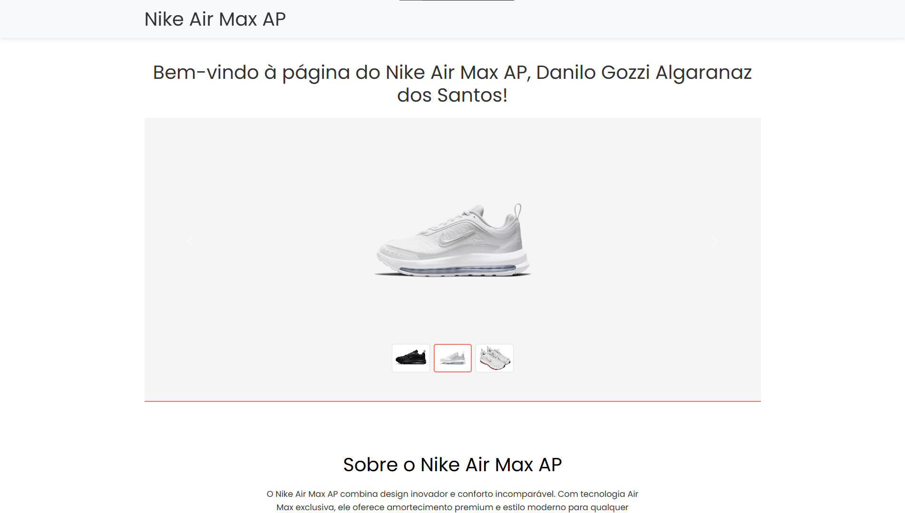
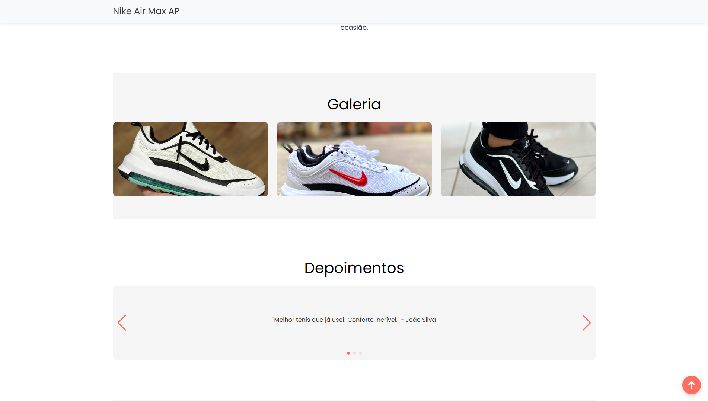
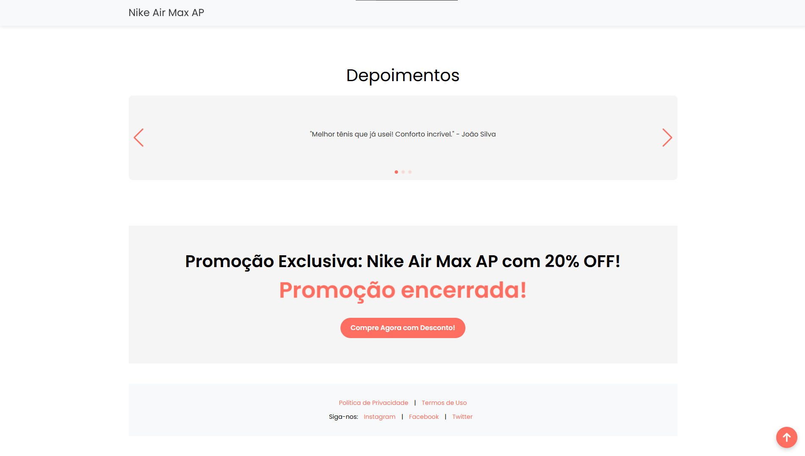

# Landing Page - Desafio H&W


Este projeto é uma landing page desenvolvida como parte do desafio técnico para a vaga de Desenvolvedor Web (Front-End) na H&W Publishing. A página inclui um formulário de captura de leads e uma seção de produto com diversas funcionalidades interativas.

## Screenshot





## Tecnologias Utilizadas

- **HTML**
- **CSS**
- **JavaScript**
- **Bootstrap 5**

## Funcionalidades

### Formulário de Captura de Leads

- **Validações:**
  - Nome: Campo obrigatório.
  - E-mail: Validação de formato de e-mail.
  - Telefone: Máscara no formato brasileiro `(99) 99999-9999`.
- **Ação após Envio:**
  - O formulário é substituído pela página de produto.
  - Exibe uma mensagem de boas-vindas com o nome do usuário.

### Página de Produto

- **Sticky Header:**
  - Cabeçalho fixo no topo durante a rolagem.
  - Animação opcional de redução de tamanho ou mudança de background.
- **Hero Section:**
  - Carrossel de imagens com thumbnails indexadas.
  - Navegação manual e automática.
- **About Section:**
  - Descrição do produto com textos explicativos e imagens.
- **Gallery Section:**
  - Grid de imagens clicáveis.
  - Modal para visualização em tela cheia com navegação (next/previous).
- **Testimonials Section:**
  - Carrossel de depoimentos com navegação manual (arrastar) e paginação.
- **Timer Countdown:**
  - Contagem regressiva para uma promoção.
  - Exibe minutos e segundos decrescentes.
  - Botão de ação abaixo do timer.
- **Footer:**
  - Links fictícios para redes sociais e políticas.

## Performance

- **PageSpeed Insights:** [Resultados](https://pagespeed.web.dev/analysis/https-alaskawebsites-github-io-desafio-H-e-W-publishing/mup5m9o9dy?form_factor=mobile)

## Como Executar Localmente

1. Clone o repositório:
   ```bash
   git clone https://github.com/alaskawebsites/desafio-H-e-W-publishing.git
   ```
