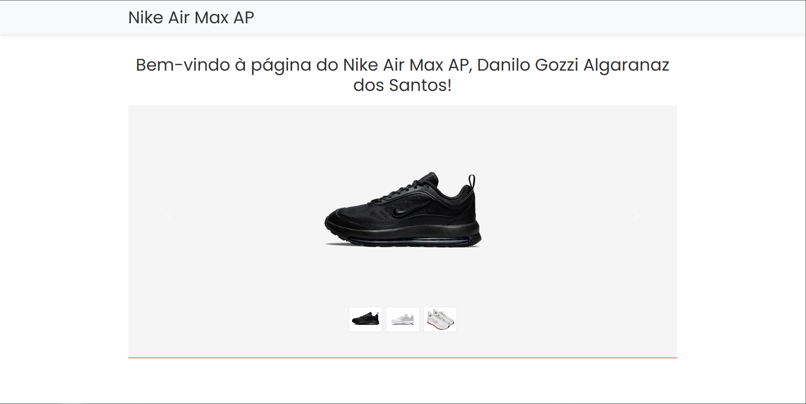

# Landing Page - Desafio H&W


Este projeto é uma landing page desenvolvida como parte do desafio técnico para a vaga de Desenvolvedor Web (Front-End) na H&W Publishing. A página inclui um formulário de captura de leads e uma seção de produto com diversas funcionalidades interativas.

## Screenshot



## Tecnologias Utilizadas

- HTML
- CSS
- JavaScript
- Bootstrap 5

## Funcionalidades

- **Formulário de Captura de Leads:**
  - Validação de nome, e-mail e telefone.
  - Máscara de telefone no formato brasileiro `(99) 99999-9999`.
  - Após o envio, o formulário é substituído pela página de produto.
- **Página de Produto:**
  - **Sticky Header:** Cabeçalho fixo no topo durante a rolagem.
  - **Hero Section:** Carrossel de imagens com thumbnails.
  - **About Section:** Descrição do produto com textos e imagens.
  - **Gallery Section:** Grid de imagens com modal para visualização em tela cheia.
  - **Testimonials Section:** Carrossel de depoimentos com navegação manual.
  - **Timer Countdown:** Contagem regressiva para uma promoção.
- **Design Responsivo:** Funciona bem em dispositivos móveis, tablets e desktops.
- **Otimizado para Performance:** Pontuação alta no Lighthouse.

## Performance

- **PageSpeed Insights:** [Resultados](https://pagespeed.web.dev/analysis/https-alaskawebsites-github-io-desafio-H-e-W-publishing/mup5m9o9dy?form_factor=mobile)

## Como Executar Localmente

1. Clone o repositório:
   ```bash
   git clone https://github.com/alaskawebsites/desafio-H-e-W-publishing.git
   ```
